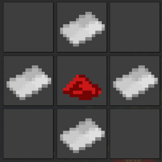
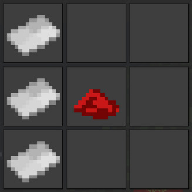
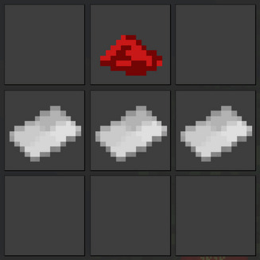

# Fai chun (揮春)

Adds [_fai chun_](https://en.wikipedia.org/wiki/Fai_chun), a traditional Chinese decoration commonly seen in various places during the [Chinese New Year](https://en.wikipedia.org/wiki/Chinese_New_Year). Comes with the following variants:

* **_Doufang_ (upright)**: Square oriented by 45 degrees. Suitable to display one single Chinese character.
* **_Doufang_ (inverted)**: The inverted version of Doufang. Traditionally used to display the character ''fu'' (福, good fortune), as the words “inverted” (倒, dao) and “arrival” (到, dao) are homonyms.
* **_Chuntiao_ (vertical)**: The most commonly seen form of _fai chun_. Suiable to display four Chinese characters aligned vertically; for example, “Cáiyuán gǔngǔn” (財源滾滾; Merchandise will turn like a wheel), “niánnián yǒuyú” (年年有餘; Surplus year-after-year), and “Xuéyè jìnbù” (學業進步; Progress in studies).
* **_Chuntiao_ (horizontal)**: The horizontal form of _chuntiao_. Usually used to display “Chūrù píng'ān” (出入平安; Safe travels); as Chinese characters are traditionally written from right to left, 安平入出 is a common alternative.
* **_Chunlian_**: Essentially longer version of the vertical _chuntiao_, with the capacity of displaying 12 Chinese characters. Used in pairs to display a [_duilian_](https://en.wikipedia.org/wiki/Duilian_(poetry)).

Yellow, mimicking gold, is the default color of _fai chun_ texts, though black is often used. All _fai chun_ nodes are optimized for displaying Chinese characters. Though possible, displaying English or other non-Chinese characters is a no-goal.

## Crafting recipes

The following items can be crafted from paper and red dye, avaliable when [Xcompat](https://content.luanti.org/packages/mt-mods/xcompat/) is installed:

| Item                    | Recipe                                                                                     |
|-------------------------|--------------------------------------------------------------------------------------------|
| _Doufang_ (upright)     |            |
| _Chuntiao_ (vertical)   |      |
| _Chuntiao_ (horizontal) |  |

The following items can be crafted from other _fai chun_ items:

| Item                    | Recipe                                             |
|-------------------------|----------------------------------------------------|
| _Doufang_ (upright)     | From a _Doufang_ (inverted)                        |
| _Doufang_ (inverted)    | From a _Doufang_ (upright)                         |
| _Chuntiao_ (vertical)   | From a _Chuntiao_ (horizontal)                     |
| _Chuntiao_ (horizontal) | From a _Chuntiao_ (vertical)                       |
| _Chunlian_              | By aligning three _Chuntiao_ (vertical) vertically |

## Helper functions

If [`modlib`](https://content.luanti.org/packages/LMD/modlib/) is installed, the following function will be enabled:

* On _Chuntiao_ (vertical) and _Chunlian_: If all the inputted texts are CJK characters, they will be split into one line per character.

## Installation guide

The only hard dependency is [Signs Lib](https://content.luanti.org/packages/mt-mods/signs_lib/). However, [Xcompat](https://content.luanti.org/packages/mt-mods/xcompat/) is needed for registering crafting recipes.

For optional helper functions, install [`modlib`](https://content.luanti.org/packages/LMD/modlib/).

## AI usage disclosure

All the models are generated with AI. `fai_chun_base.png` and `fai_chun_doufang_mark.png` are generated with ImageMagick commands generated by AI. AI-generated _duilian_ are used in the screenshot. AI is not used in other parts.
